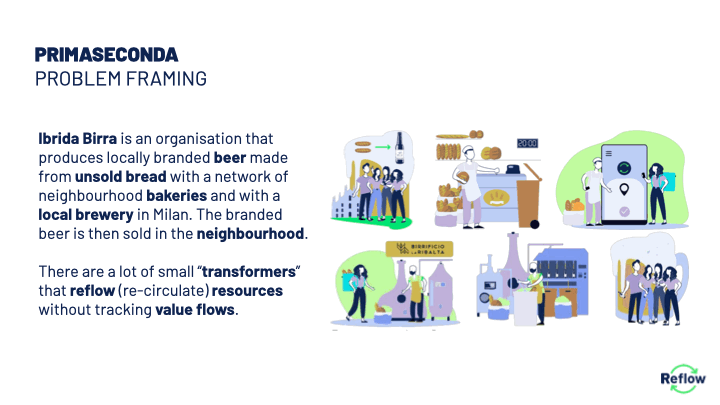
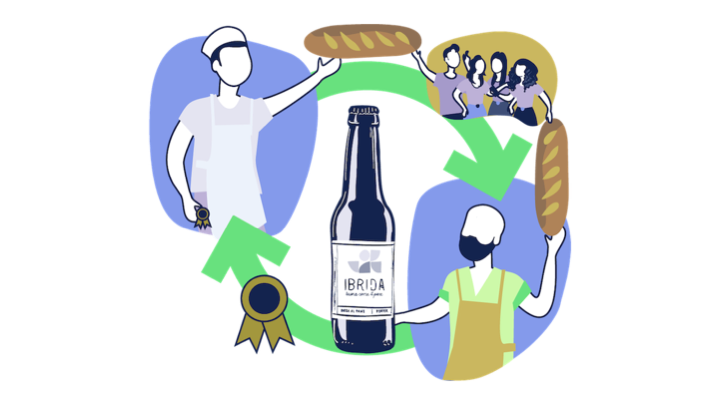
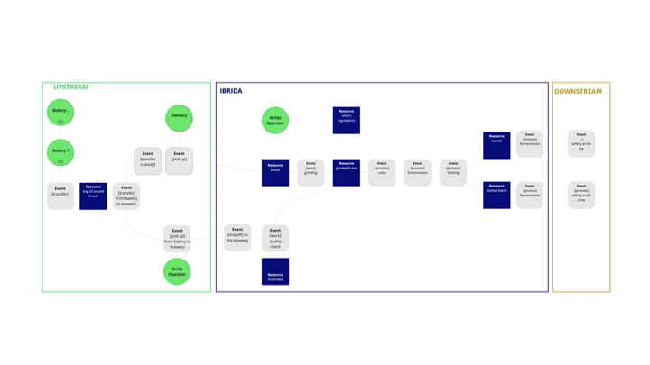
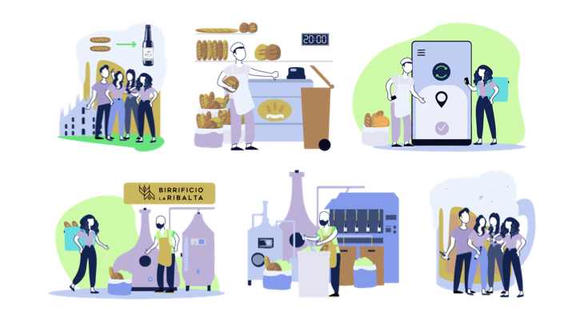
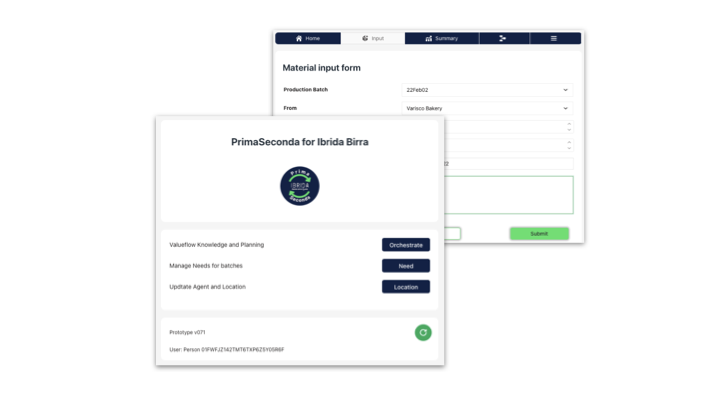

## Scenario

[Ibrida Birra](https://ibridabirra.com/) is an organisation that produces locally branded beer made from unsold bread through partnerships with a network of neighbourhood bakeries and with a local brewery in Milan.  The branded beer is then sold in the neighbourhood. This is the context of the **PrimaSeconda** scenario, in which [ReflowOS](https://reflowos.dyne.org/) tools  are used to create a customized web application (PrimaSeconda for Ibrida Birra) to manage the steps of the process and to facilitate the job for the "orchestrator" of the process (Ibrida Birra Team).

## Objective

The goal is to give value to the use of food surplus and its transformation through:
- **traceability** and monitoring of circular processes;
- **measurement** of products and resources in circular productions;
- empowerment of community **agents** and promotion of **circular good**

## The prototype

**PrimaSeconda** supports organizations (SMEs, start-ups, NGOs) that claim to have a closed circular loop but do not have technical tools to track/trace or prove that. PrimaSeconda  monitors material flows, therefore it can certify that particular processes are circular and it can "quantify" the circular loops, thereby showing their value.

The web app lets the organization manage the process of transformation. The flow of the circular value chain needs to be modelled beforehand through a high-level description diagram, using Miro or other flow chart tools.  

The pilot case can be summarised in these steps (in brackets the Ibrida Birra case):  
- Engagement and Organizing (involve bakeries to collect and donate unsold bread)
- Planning the production batch (ask for the amount of bread needed for the batch)
- Collecting (when the right amount of unsold bread is ready to be collected)
- Sorting (quality check of the bread)
- Transforming (grinding the breadcrumbs and the brewery process)
- Distributing (to the bakeries that donated the unsold bread and collaborative agents)
- Selling (communicating the branded beer, organize event to maximize the value of the circular product)

The agents are:
- Circular Material Producer (for example bakeries)
- Transformer agent (for example breweries)
- Circular Flow Orchestrator & Circular Loop Product Owner (Ibrida Birra).  

The web app serves the needs of the Flow Orchestrator during Flow Operation. With this app, a user can:  

- trigger the new production of a batch (in this case, Ibrida Beer decides to produce a batch of beer)
- input resources collected from the Producers
- update the status of the production chain through the various sub-processes (to be collected, collected, sorted, prepared for transformations, transformed, packaged (bottle, beer keg, etc.), distributed, or sold  

The web app is an operation user interface that works utilizing the ReflowOS API.  

The Value Flows model is specified using GraphQL based on a detailed REA model, which has been described at a higher level with graphics tools (as discussed above).

Through the app, the users can update the status of the various resources in the value chain.  

When a production process is finished, the user can analyse the collected data (i.e., how many kg of resources are collected, how many of them are discarded, how many are effectively up-cycled in a "reflow"). In this way, the production batch steps can create a system that creates accountability for the initiatives (i.e., by demonstrating that in a certain period a certain amount of circular resources are produced) and can serve as a tracing system for customers who wants to verify the provenance of the product.

PrimaSeconda makes APIs calls to ReflowOS with i.e. the following data:
- circular material producer
- bread collected
- bread usable
- date
- note

ReflowOS stores these data and returns two main outputs to PrimaSeconda: 

- Flow data summary about resources used for transformed products 
- Material passport with traceability of circular products

___

This prototype was developed by WeMeke during Reflow.

---

This project has received funding from the European Union's Horizon 2020 research and innovation programme under grant agreement number 820937.